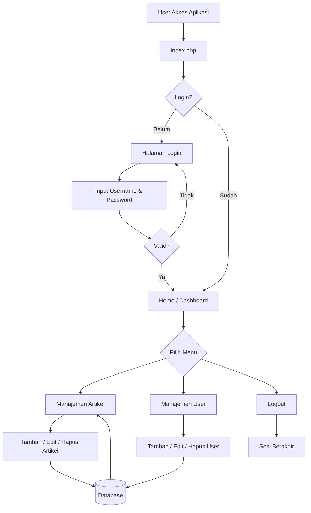

# Project PHP OOP - Manajemen Artikel & User

## Deskripsi

Project ini merupakan aplikasi **PHP berbasis OOP (Object Oriented Programming)** yang menyediakan fitur manajemen artikel dan user (login, registrasi, verifikasi, lupa password). Aplikasi menggunakan struktur modular dan pemisahan antara konfigurasi, class, module, template, dan assets.

Project ini cocok untuk pembelajaran **PHP OOP**, **CRUD**, serta penerapan struktur project PHP sederhana tanpa framework.

---

## Fitur Utama

* Autentikasi User

  * Login
  * Registrasi
  * Verifikasi akun
  * Lupa password
* Manajemen Artikel

  * Tambah artikel
  * Edit artikel
  * Hapus artikel
  * Cetak artikel
* Dashboard/Home
* Template layout (header, sidebar, footer)
* Upload dan manajemen gambar
* Koneksi database terpusat

---

## Teknologi yang Digunakan

* PHP (OOP)
* MySQL / MariaDB
* HTML, CSS
* PHP Native (tanpa framework)

---

## Struktur Project

```
lab11_php_oop/
│
├── index.php                # Entry point aplikasi
├── config.php               # Konfigurasi database & aplikasi
├── hash.php                 # Helper hash password
├── latihan_oop.sql          # Struktur database
│
├── class/                   # Class inti aplikasi
│   ├── Database.php         # Class koneksi database
│   └── Form.php             # Class helper form
│
├── module/                  # Modul aplikasi
│   ├── artikel/             # Modul manajemen artikel
│   │   ├── index.php        # List artikel
│   │   ├── tambah.php       # Tambah artikel
│   │   ├── edit.php         # Edit artikel
│   │   ├── hapus.php        # Hapus artikel
│   │   └── cetak.php        # Cetak artikel
│   │
│   ├── user/                # Modul user
│   │   ├── index.php        # List user
│   │   ├── tambah.php       # Tambah user
│   │   ├── edit.php         # Edit user
│   │   ├── hapus.php        # Hapus user
│   │   ├── lupa_password.php# Lupa password
│   │   └── verifikasi.php   # Verifikasi akun
│   │
│   └── home/
│       └── index.php        # Halaman dashboard
│
├── template/                # Template layout
│   ├── header.php
│   ├── sidebar.php
│   └── footer.php
│
└── assets/                  # Asset statis
    └── img/
        ├── user/            # Gambar user
        └── artikel/         # Gambar artikel
```

---

## Instalasi

1. **Clone / Extract Project**

   * Letakkan folder `lab11_php_oop` ke dalam folder `htdocs` (XAMPP) atau `www`.

2. **Buat Database**

   * Buat database baru di MySQL
   * Import file `latihan_oop.sql`

3. **Konfigurasi Database**

   * Edit file `config.php`

   ```php
   $host = 'localhost';
   $user = 'root';
   $pass = '';
   $db   = 'nama_database';
   ```

4. **Jalankan Aplikasi**

   * Akses melalui browser:

     ```
     http://localhost/lab11_php_oop
     ```

---

## Catatan

* Pastikan ekstensi `mysqli` aktif
* Folder `assets/img` harus memiliki permission write
* Project ini tidak menggunakan framework (Laravel, CI, dll)

---

## Alur Program Aplikasi

### 1. Entry Point (index.php)

* Aplikasi dijalankan melalui file `index.php`
* File ini berfungsi sebagai **router sederhana**
* Mengecek parameter URL untuk menentukan module dan halaman yang akan ditampilkan
* Memanggil:

  * `config.php`
  * class database
  * template header, sidebar, dan footer

---

### 2. Konfigurasi (config.php)

* Menyimpan konfigurasi utama aplikasi:

  * Koneksi database
  * Base URL
* File ini selalu dipanggil di awal eksekusi aplikasi

---

### 3. Koneksi Database (class/Database.php)

* Menggunakan konsep **OOP**
* Bertugas membuat dan mengelola koneksi ke database
* Digunakan oleh seluruh module untuk proses CRUD

---

### 4. Template Layout (template/)

* `header.php`  → Bagian atas halaman
* `sidebar.php` → Menu navigasi
* `footer.php`  → Bagian bawah halaman

Template ini membuat tampilan aplikasi konsisten di semua halaman

---

### 5. Modul Home (module/home)

* Halaman awal setelah user login
* Menampilkan dashboard atau informasi singkat aplikasi

---

### 6. Modul User (module/user)

Berfungsi untuk manajemen user dan autentikasi:

* `index.php`

  * Menampilkan daftar user
* `tambah.php`

  * Menambahkan user baru
* `edit.php`

  * Mengubah data user
* `hapus.php`

  * Menghapus user
* `verifikasi.php`

  * Verifikasi akun user
* `lupa_password.php`

  * Reset password user

Semua proses user menggunakan koneksi database dan hashing password

---

### 7. Modul Artikel (module/artikel)

Berfungsi untuk manajemen artikel:

* `index.php`

  * Menampilkan daftar artikel
* `tambah.php`

  * Menambahkan artikel baru
* `edit.php`

  * Mengubah artikel
* `hapus.php`

  * Menghapus artikel
* `cetak.php`

  * Menampilkan versi cetak artikel

Modul ini mendukung upload gambar artikel

---

### 8. Assets (assets/)

* Menyimpan file statis:

  * Gambar user
  * Gambar artikel

Folder ini digunakan saat proses upload

---

### 9. Alur Kerja Singkat

1. User mengakses `index.php`
2. Sistem memuat konfigurasi dan koneksi database
3. Sistem memanggil template layout
4. Module dipilih berdasarkan URL
5. Data diproses (CRUD) melalui database
6. Hasil ditampilkan ke user

---

## Diagram Alur Program (Flowchart)

Berikut adalah diagram alur kerja aplikasi dalam bentuk **Mermaid Flowchart** yang menggambarkan alur utama sistem:



Diagram di atas menunjukkan alur utama mulai dari user mengakses aplikasi, proses autentikasi, hingga pengelolaan data artikel dan user.

---

## Pengembangan Selanjutnya

* Implementasi MVC penuh
* Middleware autentikasi
* Role & permission user
* Validasi dan keamanan tambahan

---

## Lisensi

Project ini digunakan untuk keperluan pembelajaran.
